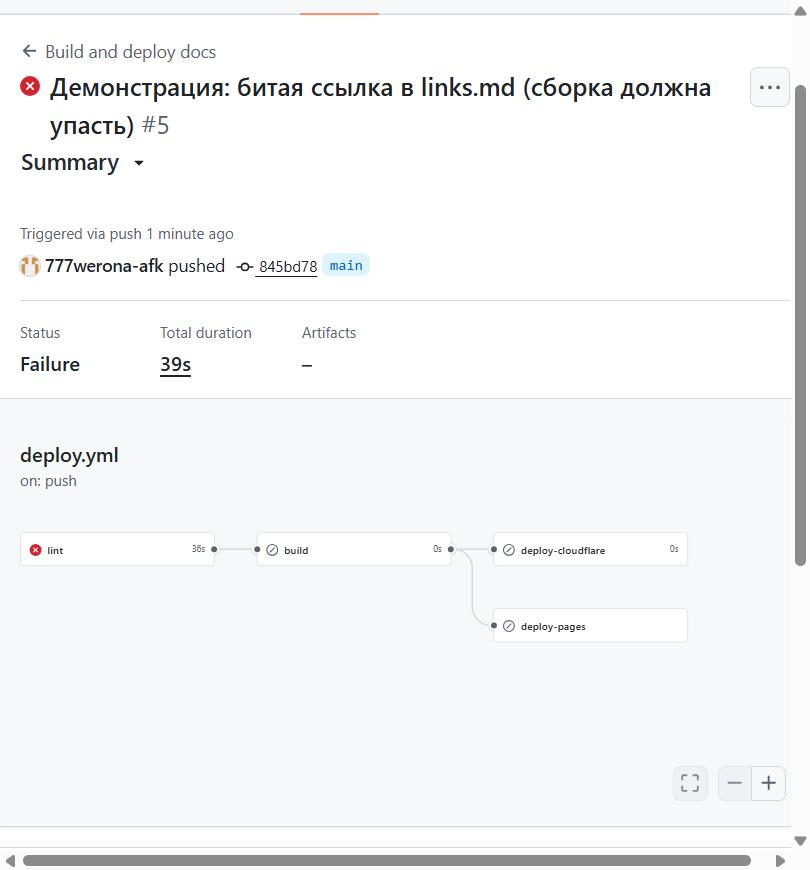
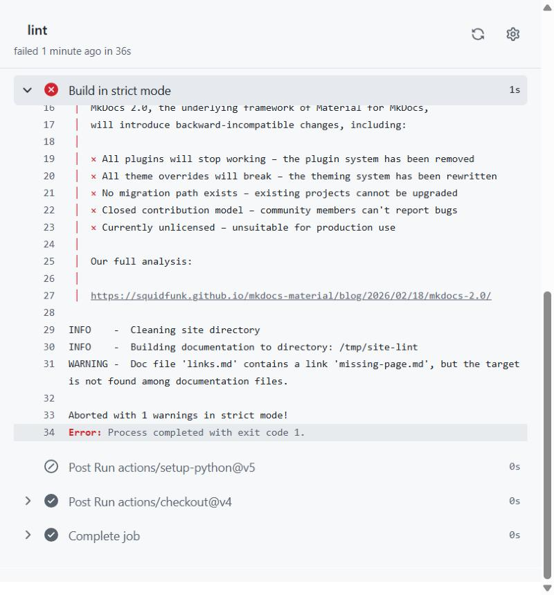
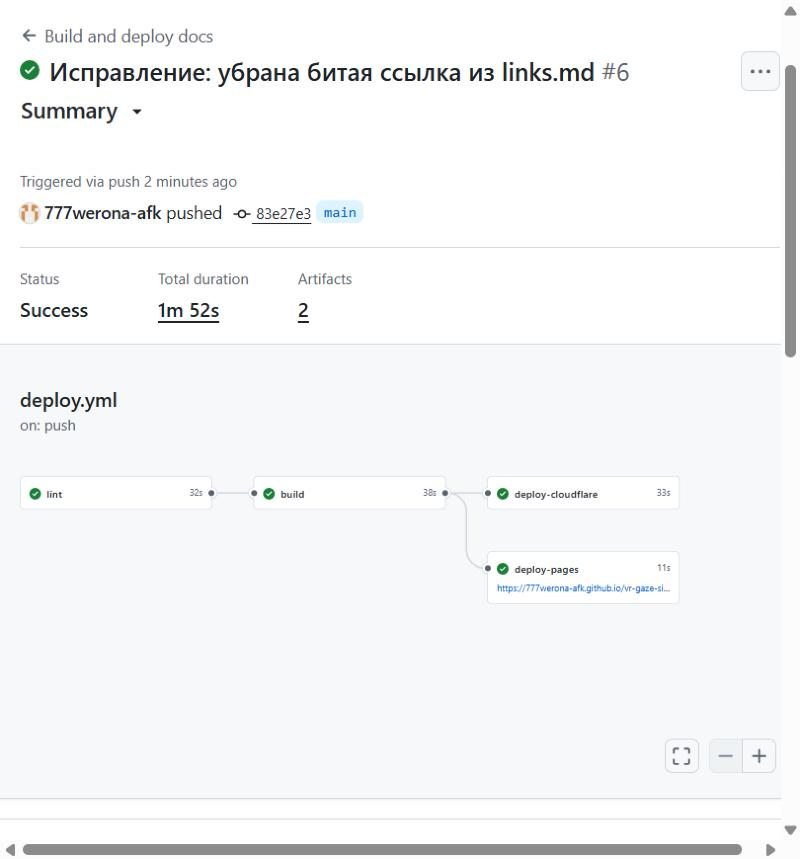

# Отладка

Ошибки, возникшие при подготовке проекта, в формате «текст ошибки → гипотеза → проверка → решение».

## 1. Строгая сборка падает на ссылках, которых ещё нет

**Текст ошибки** (`mkdocs build --strict`):

```text
WARNING -  A reference to 'debug.md' is included in the 'nav' configuration, which is not found in the documentation files.
WARNING -  Doc file 'index.md' contains a link 'debug.md', but the target is not found among documentation files.
Aborted with 7 warnings in strict mode!
```

**Гипотеза.** В `mkdocs.yml` и в таблице на главной странице уже перечислены разделы, файлы которых я ещё не создала.

**Проверка.** `ls docs/` показал, что файлов `debug.md`, `conclusion.md` и `links.md` нет; список из 7 предупреждений совпал с этими тремя файлами и ссылками на них.

**Решение.** Создать недостающие страницы. Режим `--strict` оставлен включённым и в CI: именно так битая ссылка не доходит до публикации.

## 2. Датасет с Google Drive не скачивается автоматически

**Текст ошибки.** Страница файла `dataset.zip` отдаёт форму входа в аккаунт, а не содержимое файла, поэтому скрипт или робот без авторизации получает HTML вместо архива.

**Гипотеза.** Ссылка вида `drive.google.com/file/d/<id>/view` — это страница просмотра с требованием входа, а не прямая ссылка на файл.

**Проверка.** Запрос страницы вернул описание файла (`dataset.zip`) и приглашение войти, без байтов архива.

**Решение.** Скачать архив вручную из своего аккаунта и распаковать CSV в `data/raw/`. До этого конвейер работает на синтетических демо-данных и честно отмечает это баннером на странице.

## 3. Установка пакета из сети подготовки блокируется

**Текст ошибки** (`pip install plotly`):

```text
ProxyError('Cannot connect to proxy.', OSError('Tunnel connection failed: 403 Forbidden'))
ERROR: No matching distribution found for plotly
```

**Гипотеза.** Сетевая политика среды, в которой я готовила проект, не пропускает запросы к индексу пакетов для новых зависимостей; MkDocs и Material при этом были установлены заранее.

**Проверка.** Повторный запуск с явным указанием прокси дал тот же ответ 403; значит, дело в политике доступа, а не в версии `pip`.

**Решение.** Не обходить ограничение. Интерактивные графики Plotly для P3 не требуются, поэтому графики строятся на `matplotlib`, который уже был в окружении. В CI на GitHub такого ограничения нет, и Plotly можно добавить в `requirements.txt`.

## 4. Предупреждение о MkDocs 2.0 в логе сборки

**Текст.** При каждой сборке тема Material печатает предупреждение, что MkDocs 2.0 сломает плагины и переопределения тем.

**Гипотеза.** Если в CI поставить зависимости без точных версий, `pip` может подтянуть несовместимую мажорную версию, и сборка сломается без изменений в моём коде.

**Проверка.** Версии в `requirements.txt` зафиксированы точно: `mkdocs==1.6.1`, `mkdocs-material==9.7.6`; сборка на чистом окружении даёт тот же результат.

**Решение.** Держать точные версии и обновлять их осознанно, отдельным коммитом.

## 5. Сайт делает внешние запросы к api.github.com

**Текст.** При проверке в Chromium (учёт всех сетевых запросов страницы) обнаружились два запроса, хотя на странице нет ни одного внешнего скрипта, шрифта или картинки:

```text
https://api.github.com/repos/777werona-afk/vr-gaze-site/releases/latest
https://api.github.com/repos/777werona-afk/vr-gaze-site
```

**Гипотеза.** Источник — виджет репозитория в шапке темы Material: при заданном `repo_url` он подгружает с GitHub число звёзд и версию последнего релиза. Для хостинга без доступа к внешним сервисам это лишняя зависимость.

**Проверка.** Убрала `repo_url` и `repo_name` из `mkdocs.yml`, пересобрала сайт и повторила замер: список внешних запросов стал пустым.

**Решение.** Ссылка на репозиторий осталась в подвале (`extra.social`), а виджет отключён. Страницы загружаются целиком из самого сайта.

## 6. На реальных данных «тремор» выходит в 7–12 градусов

**Текст.** Первый запуск скрипта на моих 8 сессиях дал в сводной таблице значения, которых в записи быть не может:

```text
gaze_session_20260916_210658   джиттер до 12.762°   после 10.771°
gaze_session_20260916_205941   снижение: -214162929767755.2 %
```

**Гипотезы.** (а) Деление на почти нулевое значение в первой сессии. (б) Ступеньки в сигнале угла, которые полосовой фильтр принимает за колебания. (в) Переход через ±180° у горизонтального угла.

**Проверка.** Распечатала диапазоны углов и шаги между кадрами. В первой сессии вектор взгляда не меняется вовсе, и RMS равен нулю: деление на ноль подтвердилось. Во второй сессии диапазон горизонтального угла оказался от −1129° до 54°, а шагов больше 20° между кадрами нашлось 18 (до 174° за 14 мс). Развёртка угла превращала каждый такой скачок в постоянный сдвиг. Разрывы встречаются парами с интервалом около 37–40 кадров, то есть сигнал на полсекунды «переворачивается» и возвращается.

**Решение.** Статичные сессии помечаются и не участвуют в сравнении. Шаги больше 30° между кадрами вырезаются, сегменты склеиваются, после чего тремор в полосе 4–12 Гц упал с 7 до 0,2–0,4°. Кроме того, перед этим я добавила чтение файла с BOM (`utf-8-sig`): первый столбец иначе читался как `\ufefftimestamp`.

## 7. Коммит ушёл на GitHub от другого аккаунта

**Текст.** В истории репозитория у первого коммита `46be2a4` был автор не `777werona-afk`, а другой аккаунт, хотя запуск в Actions значился «pushed by 777werona-afk».

**Гипотеза.** Автор коммита берётся из `user.name` и `user.email` в настройках Git на компьютере, а не из аккаунта, под которым выполнен `git push`. В глобальных настройках осталась другая учётная запись.

**Проверка.** `git log -1 --format="%an <%ae>"` показал имя и почту из глобального конфига, а страница пользователя на GitHub подтвердила, что пушит нужный аккаунт.

**Решение.** Задала имя и почту только для этого репозитория (noreply-адрес вида `ID+777werona-afk@users.noreply.github.com`), пересоздала коммит командой `git commit --amend --reset-author` и заменила его на GitHub через `git push --force-with-lease`. Новый коммит `7977203` создан от `777werona-afk`.

## Намеренно проваленный запуск

Чтобы показать, что режим `--strict` ловит битые ссылки, достаточно добавить в любую страницу ссылку на несуществующий файл:

```markdown
[битая ссылка](нет-такой-страницы.md)
```

Сборка завершается ошибкой, job `lint` становится красным, и ни `build`, ни `deploy` не запускаются.

Я проверила это на реальном запуске. В `docs/links.md` я добавила строку `- [Демонстрация падения сборки](missing-page.md)` и запушила её в `main` (коммит `845bd78`). Запуск №5 завершился ошибкой за 39 секунд: `lint` красный, `build`, `deploy-pages` и `deploy-cloudflare` пропущены, поэтому опубликованный сайт остался прежним.



В логе шага `Build in strict mode` MkDocs прямо называет файл и ссылку:



```text
WARNING -  Doc file 'links.md' contains a link 'missing-page.md', but the target is not found among documentation files.
Aborted with 1 warnings in strict mode!
Error: Process completed with exit code 1.
```

Исправила так: убрала добавленную строку (коммит `83e27e3`). Запуск №6 прошёл полностью: `lint`, `build`, `deploy-pages` и `deploy-cloudflare` зелёные.


