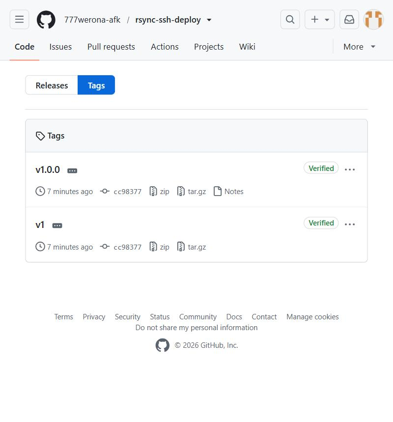
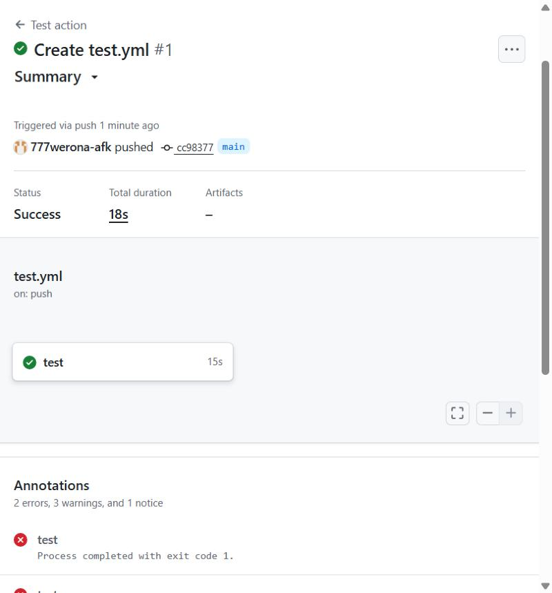
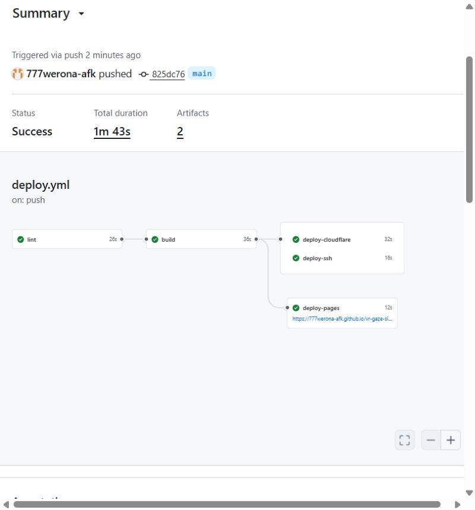

# 5. GitHub Action rsync-ssh-deploy

## 5.1. Постановка

Нужно оформить action для выкладки каталога на сервер по SSH. Требования и то, где каждое из них выполнено:

| Требование | Как выполнено | Где смотреть |
|---|---|---|
| composite или Docker-action с корректным `action.yml` (inputs, outputs, описание, branding) | composite-action; `inputs`, `outputs`, `description`, `author`, `branding` (иконка `upload-cloud`, цвет `blue`) | [action.yml](https://github.com/777werona-afk/rsync-ssh-deploy/blob/main/action.yml), [приложение А](../listings.md) |
| параметры: хост, путь назначения, исходный каталог, ключ, флаг `--delete` | `host`, `path`, `source`, `key`, `delete`; дополнительно `user`, `port`, `known_hosts`, `dry_run` | таблица ниже |
| README с примером и совместимостью | в README: пример workflow, таблицы параметров и результатов, раздел «Совместимость» | [README](https://github.com/777werona-afk/rsync-ssh-deploy#readme) |
| семантические теги `v1.0.0` и подвижный `v1` | релиз `v1.0.0`; workflow `Move major tag` переставляет `v1` на коммит релиза | [теги](https://github.com/777werona-afk/rsync-ssh-deploy/tags) |
| лицензия | MIT | [LICENSE](https://github.com/777werona-afk/rsync-ssh-deploy/blob/main/LICENSE) |
| публикация в Marketplace | не выполнено: публикация требует принять соглашение разработчика Marketplace владельцем аккаунта; action полностью работоспособен по ссылке `777werona-afk/rsync-ssh-deploy@v1` | см. раздел 5.6 |
| ссылка на реальный репозиторий, где action используется | репозиторий этого отчёта, задание `deploy-ssh` | [vr-gaze-site](https://github.com/777werona-afk/vr-gaze-site/blob/main/.github/workflows/deploy.yml) |

## 5.2. Устройство action

Action — composite: четыре шага `bash` внутри одного `action.yml`, Docker не нужен, поэтому запуск не тратит время на сборку образа.

| Шаг | Что делает |
|---|---|
| `Check inputs` | проверяет, что параметры заданы, исходный каталог существует и не пуст; в режиме `delete` отклоняет опасные пути (`/`, `.`, `~`) |
| `Prepare SSH key` | записывает ключ во временный каталог раннера с правами `600`, готовит `known_hosts` (из параметра или через `ssh-keyscan` с предупреждением) |
| `Sync with rsync` | выполняет `rsync -az --stats` (с `--delete`, если включён флаг), читает статистику и записывает `outputs` |
| `Remove key` | выполняется всегда (`if: always()`) и удаляет ключ даже после ошибки |

Параметры:

| Параметр | Обязательный | По умолчанию | Назначение |
|---|---|---|---|
| `host` | да | | сервер |
| `user` | да | | пользователь на сервере |
| `path` | да | | каталог назначения |
| `source` | нет | `site` | исходный каталог |
| `key` | да | | закрытый SSH-ключ |
| `delete` | нет | `false` | `rsync --delete`: удалить на сервере лишние файлы |
| `port` | нет | `22` | порт SSH |
| `known_hosts` | нет | пусто | строки `known_hosts` для проверки сервера |
| `dry_run` | нет | `false` | только показать план |

Результаты (`outputs`): `destination` (формат `user@host:path`), `files_transferred`, `files_deleted`.

Защита от типичных ошибок выложена в README: пустой источник вместе с `delete` стёр бы сайт на сервере, поэтому он останавливает выкладку; проверка сервера идёт с `StrictHostKeyChecking=yes`.

## 5.3. Версионирование

Релиз `v1.0.0` создан на коммите `cc98377`. После публикации тега сработал workflow `Move major tag` и поставил подвижный тег `v1` на тот же коммит. Теперь `uses: 777werona-afk/rsync-ssh-deploy@v1` получает все совместимые исправления `v1.x.y`, а `@v1.0.0` фиксирует точную версию.



```yaml
on:
  push:
    tags:
      - 'v[0-9]+.[0-9]+.[0-9]+'
# внутри задания:
#   major="${GITHUB_REF_NAME%%.*}"; git tag -f "$major" "$GITHUB_SHA"; git push -f origin "$major"
```

## 5.4. Проверка action

Workflow `Test action` на каждый push поднимает на раннере `sshd`, создаёт ключ и выполняет три проверки:

| Проверка | Ожидаемый результат | Итог |
|---|---|---|
| первая выкладка каталога с подкаталогом | файлы появились на сервере | пройдена |
| вторая выкладка после удаления файла из источника и появления лишнего файла на сервере, `delete: 'true'` | лишние файлы удалены, `destination` совпадает с ожидаемым | пройдена |
| выкладка из пустого каталога | action завершается ошибкой | пройдена (сообщение «Исходный каталог 'empty' пуст…») |

Запуск №1 завершился успехом за 18 секунд (коммит `cc98377`). Две «ошибки» в аннотациях — это ожидаемый отказ на пустом источнике (шаг с `continue-on-error`).



## 5.5. Использование в реальном репозитории

В `deploy.yml` репозитория `vr-gaze-site` добавлено задание `deploy-ssh`, которое скачивает собранный сайт и выкладывает его action'ом:

```yaml
- name: Deploy over SSH with rsync-ssh-deploy
  id: deploy
  uses: 777werona-afk/rsync-ssh-deploy@v1
  with:
    host: localhost
    user: ${{ steps.ssh.outputs.user }}
    path: /tmp/site-ssh
    source: site-hosting
    key: ${{ steps.ssh.outputs.key }}
    delete: 'true'
```

!!! note "Что это доказывает и чего не доказывает"
    У проекта нет постоянного SSH-сервера, поэтому `host: localhost`: сайт выкладывается на `sshd`, поднятый на самом раннере, и проверяется там же (файл `index.html` существует и содержит контрольную строку). Так проверены работа action в чужом репозитории по тегу `@v1` и обмен параметрами и результатами. Выкладка на постоянный удалённый сервер не проверялась. Чтобы выкладывать на настоящий сервер, достаточно заменить `host`, `user`, `path` и ключ на секреты репозитория.

Запуск №9 (коммит `825dc76`) прошёл полностью: все пять заданий зелёные, `deploy-ssh` занял 16 секунд.



## 5.6. Публикация в Marketplace

На момент подготовки отчёта action **не опубликован в GitHub Marketplace**. Всё необходимое для публикации в репозитории есть: `action.yml` с `name`, `description`, `author` и `branding`, README, лицензия MIT и релиз `v1.0.0`. Публикация делается кнопкой «Publish this release to the GitHub Marketplace» на странице релиза, но сначала владелец аккаунта должен принять соглашение для разработчиков Marketplace и включить двухфакторную аутентификацию. Пока этого не сделано, action подключается напрямую по имени репозитория и тегу: `uses: 777werona-afk/rsync-ssh-deploy@v1`. Это работает для любого публичного репозитория и подтверждено запуском №9.

## 5.7. Ограничения

- Windows-раннеры не поддерживаются: нужны `bash` и `rsync`.
- Без параметра `known_hosts` отпечаток сервера принимается при первом подключении, это менее безопасно; в README рекомендуется передавать `known_hosts` через секрет.
- Action проверялся на `ubuntu-latest` и на локальном `sshd`; другие серверы и платформы CI (например, GitVerse) не проверялись.
