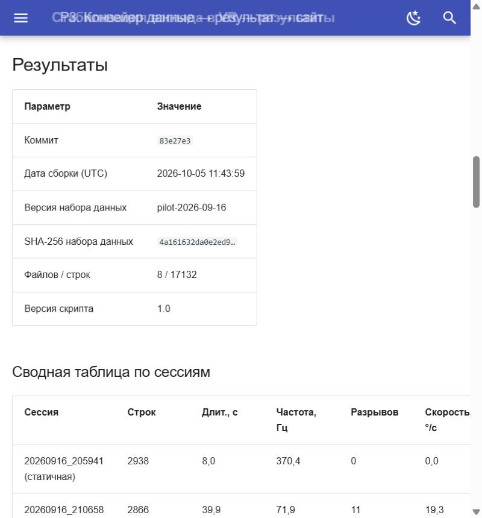
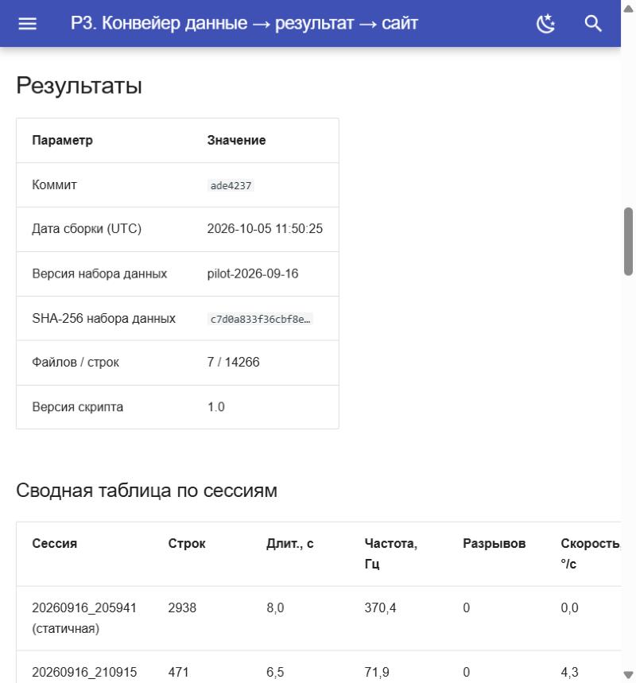

# 4. Практическая задача P3. Воспроизводимый конвейер «данные → результат → сайт»

## 4.1. Задача

Подготовить скрипт, который читает исходные данные эксперимента, выполняет расчёт и формирует графики и таблицы, и встроить его вызов в сборку сайта. Показать три вещи: обновление сайта при изменении данных, кэширование без лишнего пересчёта и метку версии на странице.

## 4.2. Данные

Входные данные — 8 CSV-логов взгляда из VR-музея, записанных 16 сентября 2026 года моей пилотной системой одной кнопкой (`gaze_session_20260916_*.csv`). Формат: `timestamp`, `gaze_x`, `gaze_y`, `gaze_z` (вектор направления взгляда), `pupil` (диаметр зрачка), `openness` (раскрытие глаза). Всего 17 132 строки, 206 секунд записи. Файлы лежат в `data/raw/`.

Что показал первый просмотр данных:

- Частота записи в семи сессиях около 72 Гц, в самой первой — около 370 Гц.
- Первая сессия (8 с) полностью статична: вектор взгляда не меняется ни в одной строке. Скрипт помечает такие сессии как «статичные» и не считает для них эффект стабилизации.
- Столбцы `pupil` и `openness` во всех сессиях равны 1,0 и информации не несут, поэтому в расчёте не используются.
- В пяти сессиях из восьми есть мгновенные разрывы направления взгляда, всего 32: между соседними кадрами вектор поворачивается на 42–174°, большинство — на 125–175°. Для глаз и головы это физически невозможно (при 72 Гц это тысячи градусов в секунду), поэтому я считаю такие шаги разрывом сигнала.

Скрипт терпим к особенностям выгрузки: сам определяет разделитель, регистр названий колонок, BOM в начале файла и единицы времени (секунды, миллисекунды, микросекунды, наносекунды).

## 4.3. Схема конвейера

```text
data/raw/*.csv ──► scripts/analyze.py ──► results/summary.csv
                        │                 results/meta.json
                        │                 generated/*.md      (таблицы и метка версии)
                        │                 docs/assets/generated/*.png  (графики)
                        ▼
                 mkdocs build --strict ──► site/  ──► GitHub Pages + Cloudflare Pages
```

В `Makefile` расчёт — зависимость сборки: `make strict` сначала вызывает `scripts/analyze.py`, затем `mkdocs build --strict`. В CI те же две команды выполняются на чистом раннере.

## 4.4. Что считает скрипт

Направление взгляда переводится в два угла (горизонтальный и вертикальный, градусы). Шаги больше 30° между соседними кадрами вырезаются, а оставшиеся сегменты склеиваются: иначе ступенька попадает в спектр и ложно увеличивает «тремор». Затем сигнал приводится к равномерной сетке по медианному шагу времени и считаются:

- **тремор** — RMS сигнала в полосе 4–12 Гц (полосовой фильтр Баттерворта 2-го порядка) по обоим углам, градусы;
- **джиттер** — RMS всего, что быстрее 2 Гц; сюда входят и быстрые произвольные движения головы, поэтому как оценку тремора я использую его осторожно;
- **частота пика** спектра в полосе тремора (метод Уэлча), только если в полосе есть настоящий локальный максимум;
- **медианная угловая скорость** взгляда;
- те же метрики после стабилизатора — фильтра One Euro (`mincutoff=1.0`, `beta=0.001`, `dcutoff=1.0`). Это простой эталонный фильтр для сравнения, а не моя обученная модель-стабилизатор.

## 4.5. Результаты

--8<-- "generated/version_stamp.md"

### 4.5.1. Сводная таблица по сессиям

--8<-- "generated/summary_table.md"

«Тремор» — RMS в полосе 4–12 Гц, «Снижение» показывает, насколько фильтр уменьшил этот показатель. Средние значения посчитаны только по сессиям, где взгляд двигался.

### 4.5.2. Графики


### 4.5.3. Чувствительность к параметру фильтра

Параметр `beta` определяет, как быстро фильтр ослабляет сглаживание при быстром движении. Я проверила три значения на всех сессиях с движением:

--8<-- "generated/sweep_table.md"

При `beta=0` фильтр — обычный низкочастотный с частотой среза 1 Гц: тремор подавляется сильнее всего, но взгляд отстаёт примерно на 120 мс, и для навигации в VR это много. При `beta=0,007` задержка вдвое меньше, но при быстрых поворотах головы фильтр почти перестаёт сглаживать: в трёх сессиях из семи тремор в полосе 4–12 Гц даже вырос. Значение `0,001` я оставила как компромисс между подавлением тремора и задержкой. Подбор параметров сделан на тех же данных, на которых измерен результат, поэтому цифры — оценка возможностей простого фильтра, а не проверка на новых данных.

## 4.6. Как воспроизвести

```bash
python3 -m venv .venv && source .venv/bin/activate
pip install -r requirements.txt
make strict        # расчёт + сборка сайта в строгом режиме
make serve         # локальный предпросмотр
```

## 4.7. Демонстрация требований P3

### 4.7.1. Изменение данных → push → обновление сайта

В CI на каждый push в `main` запускается `scripts/analyze.py`, поэтому новая версия CSV в `data/raw/` меняет таблицу, графики и метку версии без ручных действий.

Проверила на реальном запуске. Перед изменением сайт был собран из коммита `83e27e3`: 8 файлов, 17 132 строки, SHA-256 набора данных `4a161632da0e2ed9…`.



Затем я удалила из `data/raw/` одну сессию (`gaze_session_20260916_210658.csv`, 2 866 строк, 11 разрывов) и запушила коммит `ade4237` в `main`. Запуск №7 прошёл за 1 мин 40 с, сайт обновился без ручных действий: в метке версии стали коммит `ade4237`, 7 файлов, 14 266 строк (17 132 − 2 866) и другой SHA-256 набора данных `c7d0a833f36cbf8e…`. Из сводной таблицы пропала строка этой сессии.



После проверки я вернула файл коммитом-откатом (`git revert ade4237`), поэтому в текущей версии сайта снова 8 сессий и 17 132 строки.

### 4.7.2. Кэширование и замер выигрыша

Скрипт считает ключ кэша из хеша SHA-256 входных CSV, хеша самого скрипта и параметров обработки. Если ключ совпал с сохранённым в `results/.cache.json`, тяжёлый расчёт пропускается, обновляются только коммит и дата в метке версии.

Замер локальный (`make bench`): три запуска с `--force` и три повторных без изменений на моих 8 сессиях:

| Режим | Время расчёта, с | Что происходит |
|---|---|---|
| Холодный (`--force`) | 0,72 / 0,75 / 0,91 | чтение CSV, расчёт метрик, три прогона фильтра, графики |
| Тёплый (кэш) | 0,01 / 0,01 / 0,01 | совпал ключ — пересчёт пропущен |

Замер сделан в облачной среде подготовки, а не на моём компьютере и не на раннере CI. На 17 тысячах строк выигрыш небольшой в абсолютных секундах; кэш станет заметным на датасете из 50 участников, где расчёт займёт минуты.

Замер в CI на GitHub Actions (job `lint`, раннер `ubuntu-latest`, Python 3.11) для двух первых запусков:

| Запуск | Кэш pip | Install dependencies | Расчёт | Весь job `lint` |
|---|---|---|---|---|
| №1, коммит `46be2a4` | нет (первый запуск, кэш сохраняется) | 27 с | 4 с | 41 с |
| №2, коммит `7977203` | попадание (109 МБ восстановлено) | 19 с | 2 с | 28 с |

Кэш зависимостей (`cache: pip` в `actions/setup-python`) сократил установку на 8 секунд, а весь job на 13 секунд (около 32%). Расчёт в CI занимает 2–4 секунды при обоих запусках: кэш результатов лежит в `results/.cache.json`, этот файл в репозиторий не коммитится, поэтому на чистом раннере расчёт каждый раз выполняется заново. Разница между 4 и 2 секундами — разброс раннера, а не эффект кэша. Для двух запусков это одиночные замеры, статистики из них не получится.

### 4.7.3. Метка версии на странице

Блок «Метка версии» выше формируется скриптом и содержит хеш коммита, дату сборки в UTC, версию набора данных (из файла `data/DATASET_VERSION`) и SHA-256 всех входных CSV. По нему опубликованный результат однозначно связывается с версией кода и данных.

## 4.8. Ограничения

- Таблица и графики описывают одну пилотную запись одного автора (8 сессий, 206 секунд). Сравнение групп с ОВЗ и без ОВЗ — задача будущего сбора данных, пилотных данных для него недостаточно.
- Метки «тремор» и «джиттер» — оценки по сигналу взгляда в градусах и по спектру; в данных остаются быстрые произвольные движения головы, поэтому для клинических выводов эти значения не предназначены.
- Порог разрыва 30° выбран по виду данных: обычные шаги между кадрами не превышают 7°, а следующие по величине — 42° и больше, так что значения между 7° и 42° в записи не встречаются. Причину разрывов я не устанавливала.
- Стабилизатор в расчёте — эталонный фильтр One Euro, а не обученная модель; сравнение с моделью — отдельная работа.
