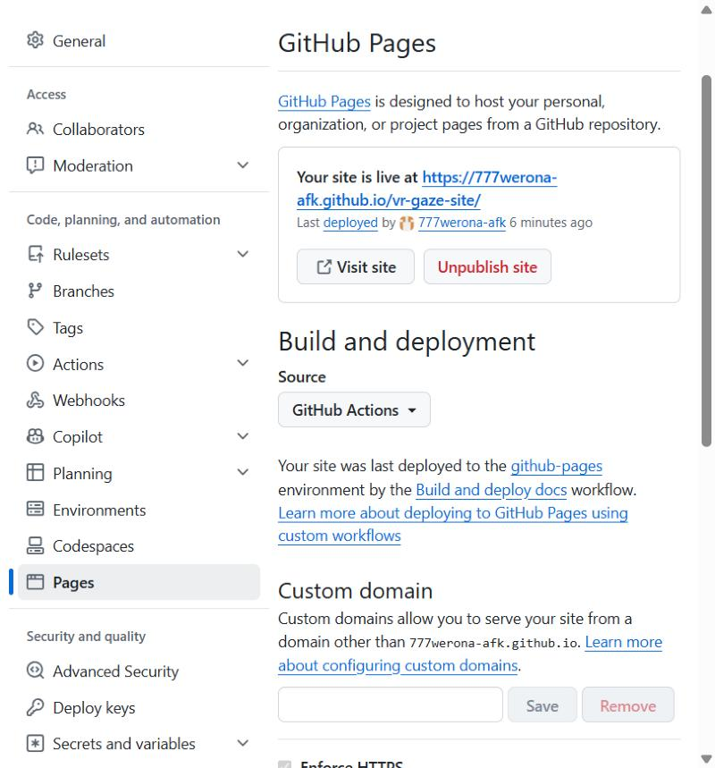

# 2. Ход работы

## 2.1. Шаги задания

Ниже — шаги из задания и то, как каждый из них выполнен в этом репозитории.

| № | Шаг задания | Как выполнено |
|---|---|---|
| 1 | Python, `pip`, `virtualenv` | Python 3.11; окружение создаётся командой `python3 -m venv .venv` |
| 2 | Установить `virtualenv`, если нет | использован встроенный модуль `venv`, которого достаточно для задачи |
| 3 | Каталог проекта и окружение | каталог `vr-gaze-site/`, окружение `.venv/` |
| 4 | Зафиксировать зависимости, `.gitignore` | `requirements.txt` с точными версиями; `.gitignore` исключает окружение, `site/`, `_build/`, кэш |
| 5 | Установить MkDocs, создать каркас | MkDocs 1.6.1 с темой Material 9.7.6; настройки в `mkdocs.yml` |
| 6 | Локальная сборка | `mkdocs serve` для предпросмотра, затем `mkdocs build --strict` |
| 7 | Репозиторий и отправка на GitHub | `git init`, репозиторий `vr-gaze-site` на GitHub |
| 8 | GitHub Actions, Pages → Source = GitHub Actions | `.github/workflows/deploy.yml`, публикация через `upload-pages-artifact` и `deploy-pages` |
| 9 | Сервер или аккаунт на хостинге | аккаунт Cloudflare; токен API и идентификатор аккаунта хранятся в секретах репозитория (`CLOUDFLARE_API_TOKEN`, `CLOUDFLARE_ACCOUNT_ID`) |
| 10 | Скорректировать YAML под площадку | отдельное задание `deploy-cloudflare`: сборка с другим `SITE_URL`, выкладка командой `wrangler pages deploy` |
| 11 | Базовый URL | `site_url` берётся из переменной окружения `SITE_URL`; `use_directory_urls: true`; ссылки относительные |
| 12 | Проверка не только на глаз | шаг `healthcheck` в CI: код ответа HTTP 200 и контрольная строка в HTML; поиск и отображение без внешних CDN |
| 13 | Лицензии | контент — CC BY 4.0 (`LICENSE-CONTENT.md`), код — MIT (`LICENSE`) |
| 14 | Отладка | раздел [Отладка](debug.md) |
| 15 | Собственный GitHub Action | репозиторий [rsync-ssh-deploy](practice/action.md): composite-action, теги `v1.0.0` и `v1`, лицензия MIT |
| 16 | Использование action в реальном репозитории | задание `deploy-ssh` в `deploy.yml` этого репозитория вызывает `777werona-afk/rsync-ssh-deploy@v1` |

## 2.2. Базовый URL и подкаталог

MkDocs строит страницы с относительными ссылками, поэтому один и тот же `site/` работает и в корне домена, и в подкаталоге. Абсолютный адрес нужен только для `sitemap.xml` и канонических ссылок. Он задаётся переменной окружения:

```yaml
site_url: !ENV [SITE_URL, "https://777werona-afk.github.io/vr-gaze-site/"]
```

В CI сайт собирается дважды: с адресом GitHub Pages и с адресом на Cloudflare Pages. Типичная ошибка при размещении в подкаталоге — абсолютные пути вида `/assets/...`; здесь их нет.

## 2.3. Проверка результата развёртывания

После выкладки пайплайн запрашивает опубликованный адрес и проверяет код ответа и наличие контрольной строки в HTML:

```bash
code=$(curl -s -o page.html -w '%{http_code}' "$URL")
test "$code" = "200"
grep -q 'Стабилизация взгляда в VR' page.html
```

Сайт не обращается к внешним серверам: шрифты отключены настройкой `font: false`, иконки и скрипты темы отдаются из самого сайта, формулы не используются. Поиск работает на клиенте с русской морфологией (`lang: ru`).

Настройки GitHub Pages: источник публикации — GitHub Actions, сайт доступен по адресу `https://777werona-afk.github.io/vr-gaze-site/`.



Успешный запуск с проверкой после выкладки (шаг `Healthcheck`) на обоих хостингах показан на скриншоте зелёного запуска в разделе [«Отладка»](debug.md), полный запуск с тремя вариантами выкладки — в [разделе 5](practice/action.md).

## 2.4. Описание пайплайна

Полный текст `deploy.yml` с комментариями приведён в [приложении А](listings.md). Ниже — что делает каждое задание и зачем оно нужно.

| Задание | Когда выполняется | Что делает | Почему так |
|---|---|---|---|
| `lint` | на каждый push и pull request | ставит зависимости (кэш `pip`), запускает `scripts/analyze.py`, собирает сайт в режиме `--strict` во временный каталог | ловит битые ссылки и ошибки расчёта до публикации; при ошибке остальные задания не запускаются |
| `build` | после `lint` | повторяет расчёт, собирает сайт дважды (адрес GitHub Pages и адрес Cloudflare), сохраняет два артефакта | два разных `SITE_URL` нужны для корректного `sitemap.xml` на каждом хостинге |
| `deploy-pages` | только `main`, не pull request | публикует артефакт через `actions/deploy-pages`, затем проверяет страницу по HTTP | права `pages: write` и `id-token: write` выданы только этому заданию |
| `deploy-cloudflare` | только `main`, не pull request | создаёт проект, выкладывает каталог командой `wrangler pages deploy`, проверяет страницу; без секретов шаги пропускаются | выкладка на shell-командах переносится между платформами без переписывания |
| `deploy-ssh` | только `main`, не pull request | выкладывает сайт собственным action `rsync-ssh-deploy@v1` на `sshd`, поднятый на раннере, и проверяет копию | показывает использование action в реальном workflow; замена `host`, `user`, `path` и ключа превращает его в выкладку на настоящий сервер |

Принятые решения: права токена `contents: read` по умолчанию, расширяются только в заданиях выкладки; `concurrency` отменяет устаревший запуск для той же ветки; секреты не печатаются в лог, ключ SSH живёт во временном каталоге раннера и удаляется последним шагом action.
